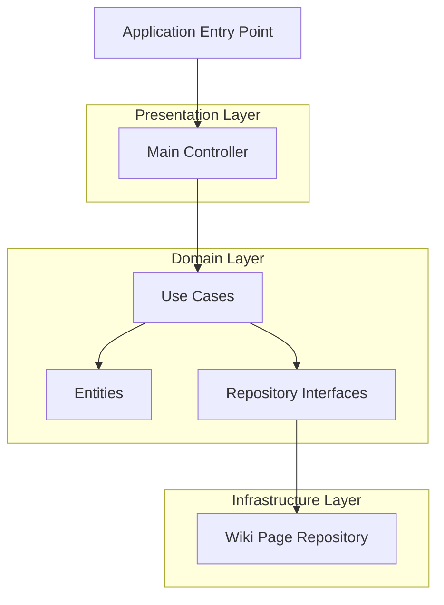

# Clean Architecture Plan for CI/CD Log Task

## Current State Analysis

The current `tasks/ci_cd_log_task/bot.py` is a monolithic script that mixes:
- **Configuration** (lines 7-18)
- **Data fetching logic** (lines 23-61) 
- **Message formatting** (lines 66-102)
- **Wiki operations** (lines 104-108)

## Clean Architecture Pattern in Your Project

Your existing tasks follow a clean architecture pattern with these layers:

1. **Domain Layer** (core business logic)
   - `entities/`: Core data models
   - `use_cases/`: Business logic implementations
   - `repositories/`: Data access interfaces

2. **Presentation Layer** (interfaces and controllers)
   - Handles user interactions and orchestrates use cases

3. **Infrastructure Layer** (external dependencies)
   - Database connections, API calls, etc.

## Architecture Diagram



## Directory Structure

```
tasks/ci_cd_log_task/
├── __init__.py
├── main.py                    # Application entry point
├── domain/
│   ├── __init__.py
│   ├── entities/
│   │   ├── __init__.py
│   │   ├── commit_info.py     # Commit information entity
│   │   └── bot_log.py         # Bot log message entity
│   ├── use_cases/
│   │   ├── __init__.py
│   │   ├── fetch_commit_data.py
│   │   ├── fetch_contributors.py
│   │   └── create_log_message.py
│   └── repositories/
│       ├── __init__.py
│       ├── github_repository.py
│       └── wiki_repository.py
├── presentation/
│   ├── __init__.py
│   └── bot_controller.py      # Main controller
└── infrastructure/
    ├── __init__.py
    ├── github_api.py          # GitHub API implementation
    └── wiki_operations.py     # Wiki operations implementation
```

## Implementation Plan

### 1. Domain Entities (Pure data models)

#### CommitInfo Entity
- **Purpose**: Contains commit information from GitHub
- **Properties**: commit_message, commit_date, commit_html_url, last_commit_author
- **Methods**: `__str__`, `__repr__`, validation methods

#### BotLog Entity
- **Purpose**: Contains formatted log message for wiki
- **Properties**: tool_name, bot_version, commit_info, contributors, timestamp
- **Methods**: `format_message()`, validation methods

### 2. Repository Interfaces (Data access contracts)

#### GitHubRepository Interface
- **Purpose**: Abstract interface for GitHub operations
- **Methods**:
  - `fetch_latest_commit(repo_owner: str, repo_name: str, branch: str) -> CommitInfo`
  - `fetch_contributors(repo_owner: str, repo_name: str) -> List[str]`

#### WikiRepository Interface
- **Purpose**: Abstract interface for wiki operations
- **Methods**:
  - `save_log_message(page_title: str, log_message: BotLog) -> None`
  - `get_page_content(page_title: str) -> str`

### 3. Use Cases (Business logic)

#### FetchCommitData Use Case
- **Purpose**: Retrieves latest commit from GitHub
- **Dependencies**: GitHubRepository
- **Methods**: `execute(repo_owner, repo_name, branch) -> CommitInfo`

#### FetchContributors Use Case
- **Purpose**: Retrieves contributor list from GitHub
- **Dependencies**: GitHubRepository
- **Methods**: `execute(repo_owner, repo_name) -> List[str]`

#### CreateLogMessage Use Case
- **Purpose**: Formats the wiki message with all details
- **Dependencies**: CommitInfo, contributors list
- **Methods**: `execute(commit_info, contributors, tool_name, bot_version) -> BotLog`

### 4. Infrastructure Implementations

#### GitHubAPI Implementation
- **Purpose**: Concrete implementation of GitHubRepository
- **Dependencies**: requests library
- **Methods**: Implements all GitHubRepository interface methods
- **Error Handling**: Graceful fallback to default values

#### WikiOperations Implementation
- **Purpose**: Concrete implementation of WikiRepository
- **Dependencies**: pywikibot library
- **Methods**: Implements all WikiRepository interface methods
- **Error Handling**: Logging and error recovery

### 5. Presentation Layer

#### BotController
- **Purpose**: Main application controller
- **Dependencies**: All use cases
- **Methods**: 
  - `configure()`: Set up configuration from environment variables
  - `run()`: Execute the complete workflow
  - `handle_errors()`: Centralized error handling

### 6. Main Application Entry Point

#### main.py
- **Purpose**: Application entry point
- **Functionality**: 
  - Initialize the application
  - Create dependency injection container
  - Start the BotController
  - Handle application lifecycle

## Key Design Decisions

### 1. Error Handling Strategy
- Each use case handles its own exceptions gracefully
- Fallback to default values when API calls fail
- Comprehensive logging throughout all layers
- User-friendly error messages in Arabic

### 2. Configuration Management
- Externalized through environment variables (preserving existing behavior)
- Configuration validation in the presentation layer
- Default values for all required parameters

### 3. Logging Strategy
- Centralized logging configuration
- Different log levels for different types of messages
- Structured logging for better debugging
- Arabic log messages where appropriate

### 4. Type Safety
- Full type hints following existing patterns in the codebase
- Proper imports and module organization
- Consistent naming conventions

### 5. Dependency Injection
- Constructor injection for all dependencies
- Interface-based design for testability
- Clear separation of concerns

## Migration Strategy

### 1. Preserve Existing Functionality
- The bot will work exactly the same after refactoring
- Same environment variables and configuration
- Same output format and wiki page content

### 2. Gradual Refactoring
- Each component can be tested independently
- Easy to modify individual parts without affecting others
- Clear boundaries between layers

### 3. Backward Compatibility
- Maintain the same command-line interface
- Keep the same environment variable names
- Preserve the same wiki page format

## Benefits of This Architecture

### 1. Separation of Concerns
- Each layer has a single, well-defined responsibility
- Clear boundaries between business logic and infrastructure
- Easier to understand and maintain

### 2. Testability
- Business logic can be tested without external dependencies
- Mock implementations for repositories in unit tests
- Each use case can be tested in isolation

### 3. Maintainability
- Changes to one layer don't affect others
- Clear interfaces make it easy to understand dependencies
- Easier to onboard new developers

### 4. Reusability
- Components can be reused in different contexts
- Repository interfaces allow for different implementations
- Use cases can be composed in different ways

### 5. Dependency Inversion
- High-level modules don't depend on low-level modules
- Both depend on abstractions (interfaces)
- Follows SOLID principles

## Implementation Checklist

- [ ] Create domain entities (CommitInfo, BotLog)
- [ ] Create repository interfaces (GitHubRepository, WikiRepository)
- [ ] Implement use cases (FetchCommitData, FetchContributors, CreateLogMessage)
- [ ] Create infrastructure implementations (GitHubAPI, WikiOperations)
- [ ] Create presentation layer (BotController)
- [ ] Create main application entry point
- [ ] Update __init__.py files
- [ ] Test the refactored implementation

## Environment Variables (Preserved)

The following environment variables will be preserved:
- `LOGNAME`: Tool name for the log message
- GitHub repository configuration (hardcoded in current implementation)
- Wiki site configuration (hardcoded in current implementation)

## Testing Strategy

### Unit Tests
- Test each use case in isolation
- Mock repository implementations
- Test edge cases and error conditions

### Integration Tests
- Test the complete workflow
- Test with real GitHub API (when available)
- Test with real wiki operations (when available)

### End-to-End Tests
- Test the complete application flow
- Verify the final wiki page content
- Test error recovery scenarios