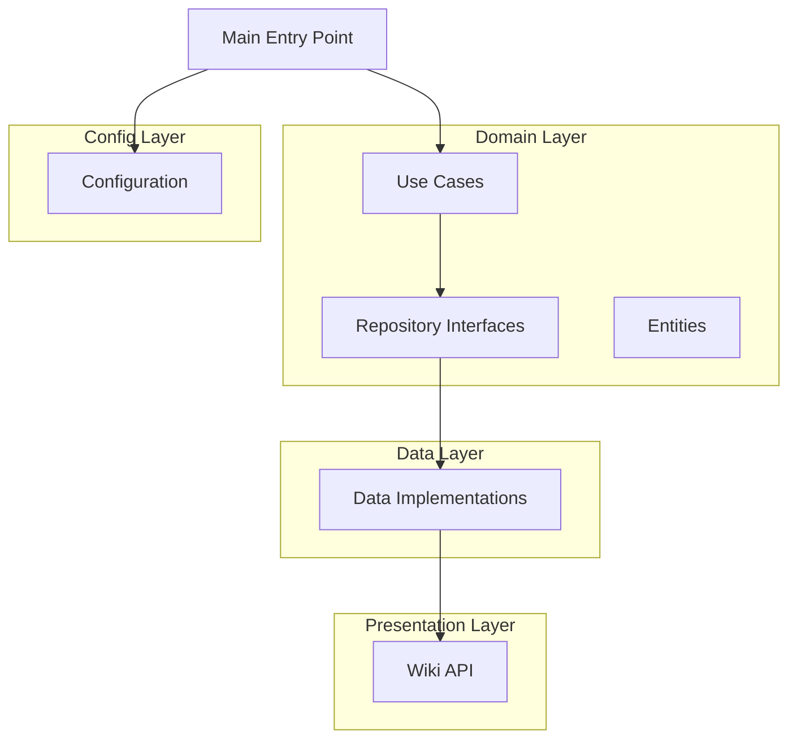

# Clean Architecture Plan for autoCreatePages

## Overview

This document outlines the plan for refactoring the `autoCreatePages` task to follow clean architecture principles, following the same pattern used in the `copypatrol` task.

## Current Code Analysis

### Issues with Current Implementation
1. **Mixed responsibilities**: The `Create` class handles date logic, wiki operations, and page creation
2. **Tight coupling**: Direct dependency on `pywikibot` throughout the code
3. **Hard-coded data**: Page templates and configurations are embedded in the code
4. **No separation of concerns**: Business logic is mixed with infrastructure concerns

### Current Components
- `MonthName` class: Handles month name conversion
- `Create` class: Main business logic mixed with wiki operations
- `my_pages_list`: Hard-coded page configurations
- `create_block_cat.py`: Separate script for creating block categories

## Target Architecture

### Directory Structure
```
tasks/autoCreatePages/
├── __init__.py
├── main.py
├── config/
│   ├── __init__.py
│   └── config_loader.py
├── domain/
│   ├── __init__.py
│   ├── entities/
│   │   ├── __init__.py
│   │   ├── page.py
│   │   └── category.py
│   ├── repositories/
│   │   ├── __init__.py
│   │   ├── page_repository.py
│   │   └── category_repository.py
│   └── use_cases/
│       ├── __init__.py
│       ├── create_monthly_pages.py
│       └── create_block_category.py
├── data/
│   ├── __init__.py
│   ├── wiki_page_repository.py
│   └── wiki_category_repository.py
└── presentation/
    ├── __init__.py
    └── wiki_operations.py
```

### Architecture Layers

#### Domain Layer (Innermost)
- **Entities**: `Page`, `Category` - core business objects
- **Repositories**: Abstract interfaces for data access
- **Use Cases**: `CreateMonthlyPages`, `CreateBlockCategory` - application-specific business rules

#### Data Layer
- **Implementations**: Concrete repository implementations using `pywikibot`

#### Presentation Layer
- **Wiki Operations**: Handles direct wiki API interactions

#### Configuration Layer
- **Config Management**: Externalized configuration for templates and settings

## Implementation Plan

### Phase 1: Domain Layer
1. **Create Entities**
   - `Page` entity: Represents a wiki page with title, content, and creation message
   - `Category` entity: Represents a wiki category with name, template, and creation message

2. **Create Repository Interfaces**
   - `PageRepository`: Abstract interface for page operations
   - `CategoryRepository`: Abstract interface for category operations

3. **Create Use Cases**
   - `CreateMonthlyPages`: Business logic for creating monthly maintenance pages
   - `CreateBlockCategory`: Business logic for creating block user categories

### Phase 2: Data Layer
1. **Implement Repository Interfaces**
   - `WikiPageRepository`: Concrete implementation using `pywikibot`
   - `WikiCategoryRepository`: Concrete implementation using `pywikibot`

### Phase 3: Presentation Layer
1. **Create Wiki Operations**
   - `WikiOperations`: Handles direct wiki API interactions
   - Separates infrastructure concerns from business logic

### Phase 4: Configuration Layer
1. **Create Configuration Management**
   - `ConfigLoader`: Loads external configuration for templates and settings
   - Move hard-coded templates to external configuration

### Phase 5: Main Entry Point
1. **Create main.py**
   - Follows the same pattern as `copypatrol/main.py`
   - Orchestrates the layers and dependencies

### Phase 6: Testing
1. **Create Comprehensive Tests**
   - Unit tests for domain entities and use cases
   - Integration tests for repository implementations
   - Mock external dependencies for testing

## Key Components Design

### Domain Entities

#### Page Entity
```python
# domain/entities/page.py
class Page:
    def __init__(self, title: str, content: str, creation_message: str):
        self.title = title
        self.content = content
        self.creation_message = creation_message
```

#### Category Entity
```python
# domain/entities/category.py  
class Category:
    def __init__(self, name: str, template: str, creation_message: str):
        self.name = name
        self.template = template
        self.creation_message = creation_message
```

### Repository Interfaces

#### Page Repository
```python
# domain/repositories/page_repository.py
from abc import ABC, abstractmethod

class PageRepository(ABC):
    @abstractmethod
    def page_exists(self, title: str) -> bool:
        pass
    
    @abstractmethod
    def create_page(self, page: Page) -> None:
        pass
```

#### Category Repository
```python
# domain/repositories/category_repository.py
from abc import ABC, abstractmethod

class CategoryRepository(ABC):
    @abstractmethod
    def category_exists(self, name: str) -> bool:
        pass
    
    @abstractmethod
    def create_category(self, category: Category) -> None:
        pass
```

### Use Cases

#### Create Monthly Pages
```python
# domain/use_cases/create_monthly_pages.py
from datetime import datetime
from tasks.autoCreatePages.domain.repositories.page_repository import PageRepository
from tasks.autoCreatePages.domain.entities.page import Page

class CreateMonthlyPages:
    def __init__(self, page_repository: PageRepository):
        self.page_repository = page_repository
    
    def execute(self, page_configs: list, current_date: datetime) -> None:
        # Business logic for creating monthly pages
        pass
```

#### Create Block Category
```python
# domain/use_cases/create_block_category.py
from datetime import datetime
from tasks.autoCreatePages.domain.repositories.category_repository import CategoryRepository
from tasks.autoCreatePages.domain.entities.category import Category

class CreateBlockCategory:
    def __init__(self, category_repository: CategoryRepository):
        self.category_repository = category_repository
    
    def execute(self, category_config: dict, current_date: datetime) -> None:
        # Business logic for creating block category
        pass
```

## Benefits of This Architecture

1. **Testability**: Each layer can be tested independently with mocks
2. **Maintainability**: Clear separation of concerns makes code easier to understand and modify
3. **Scalability**: New features can be added without affecting existing code
4. **Reusability**: Domain entities and use cases can be reused in different contexts
5. **Dependency Inversion**: High-level modules don't depend on low-level modules

## Migration Strategy

1. **Phase 1**: Create the new directory structure and interfaces
2. **Phase 2**: Implement domain entities and use cases
3. **Phase 3**: Implement repository interfaces with `pywikibot` dependencies
4. **Phase 4**: Create presentation layer and configuration management
5. **Phase 5**: Refactor existing code to use the new architecture
6. **Phase 6**: Add comprehensive tests

## Architecture Diagram



## Maintained Functionality

The refactored code will maintain all existing functionality:
- Creation of monthly maintenance pages with Arabic templates
- Block category creation functionality
- Date validation (only runs on first day of month)
- Page existence checking
- Same page creation messages and templates

## Testing Strategy

1. **Unit Tests**: Test domain entities and use cases in isolation
2. **Integration Tests**: Test repository implementations with mocked wiki API
3. **End-to-End Tests**: Test the complete workflow with real wiki API (limited scope)

## Configuration Management

Templates and page configurations will be moved to external configuration files:
- `config/pages_config.json`: Monthly page configurations
- `config/categories_config.json`: Category configurations
- `config/config_loader.py`: Configuration loading utilities

## Dependencies

The refactored code will maintain the same external dependencies:
- `pywikibot`: For wiki API interactions
- `datetime`: For date handling
- `logging`: For logging functionality

## Timeline

- **Phase 1-2**: Domain Layer (2-3 days)
- **Phase 3**: Data Layer (1-2 days)
- **Phase 4**: Presentation & Config (1-2 days)
- **Phase 5**: Main Entry Point (1 day)
- **Phase 6**: Testing (2-3 days)
- **Total**: 7-11 days

## Success Criteria

1. All existing functionality is preserved
2. Code follows clean architecture principles
3. Each layer is properly separated and testable
4. Configuration is externalized
5. Comprehensive test coverage is achieved
6. Code is maintainable and extensible